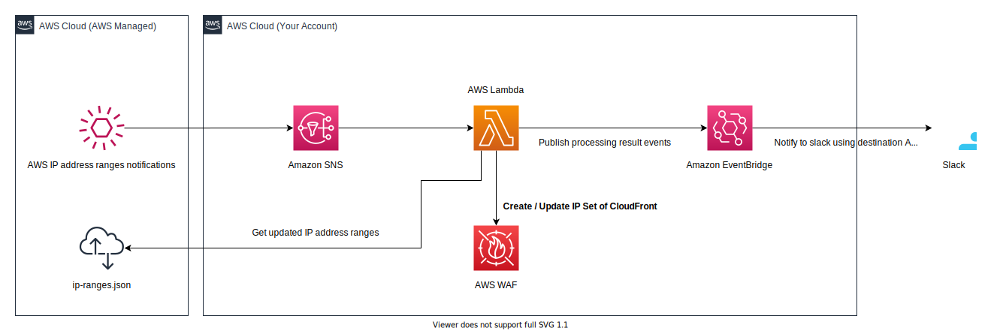

# CloudFront IP Set for AWS WAF

This is a CDK stack to create / update IP Sets that have Global and Regional CloudFront IP addresses when the AWS IP addresses range is changed. And if you want, enable to notify you result of refresh IP Set via slack.

About AWS WAF IP Set, you can see [AWS Documents](https://docs.aws.amazon.com/waf/latest/developerguide/waf-ip-set-managing.html).

## Use Case

These IP Sets help to limit the requests to the ALB to access via CloudFront. The IP Sets are updated by triggering notifications of IP Range changes by AWS, so it can keep up with the latest IP Range.

## Stack Overview

* Subscribe the `AmazonIpSpaceChanged` topic of Amazon SNS. It's provided by AWS.
	* See more : https://docs.aws.amazon.com/general/latest/gr/aws-ip-ranges.html#subscribe-notifications
* When the notification is received, a Lambda function is triggered.
* The Lambda function get newest IP address ranges from [`ip-ranges.json`](https://ip-ranges.amazonaws.com/ip-ranges.json), and create or update 2 AWS WAF IP Sets in specified a region.
	* One IP Set is a collection of Global CloudFront IP addresses.
	* The other one, Regional CloudFront IP addresses.
	* The each default IP Sets names are `<Stack-Name>-CloudFront-Global` and `<Stack-Name>-CloudFront-Regional`.
* If you want, you can receive a notification to result of refresh IP Set via Slack. Using Amazon EventBridge destination API to invoke Slack API.
	* Specify context variable `slackWebHookUrl` at deploy.
	* ex: `cdk deploy -c slackWebHookUrl=https://hooks.slack.com/.....`
## How to deploy

 * `git clone https://github.com/msysh/aws-sample-cdk-auto-update-waf-ip-set-of-cloudfront.git`
 * `cd aws-sample-cdk-auto-update-waf-ip-set-of-cloudfront/lambda`
 * `npm install` or `yarn install`
 * `cd ../`
 * `npm run build` or `yarn build`
 * `cdk deploy -c slackWebHookUrl=https://hooks.slack.com/.....` : deploy this stack to your default AWS account/region
	* If you need not slack notification, `cdk deply`

## How to delete resources

* `cdk destroy`
* Delete AWS WAF IP Sets using Management Console or AWS CLI.